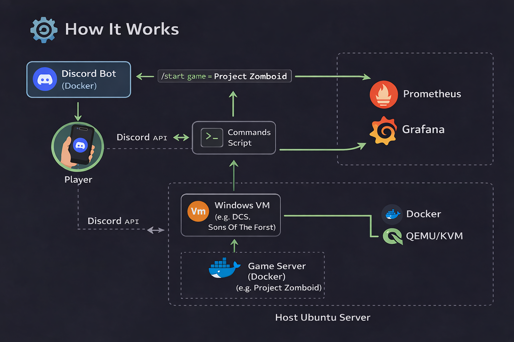
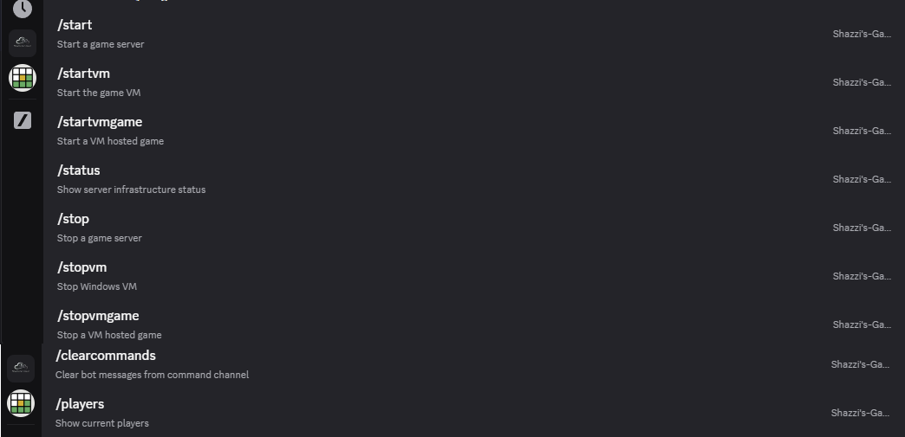
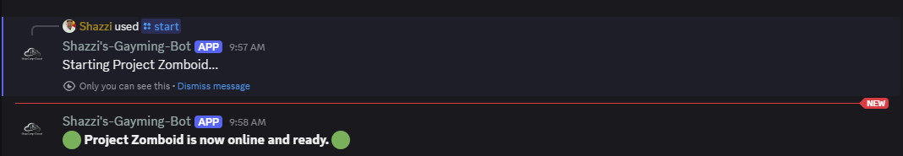
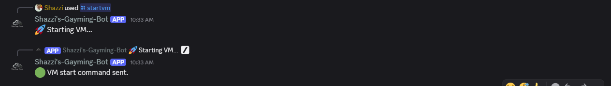
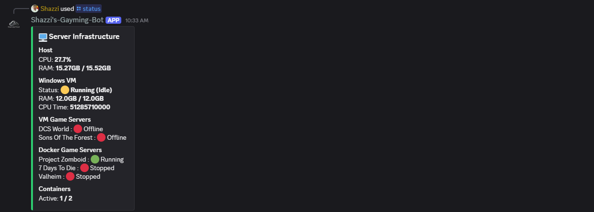

<<<<<<< HEAD
# Azure Game Server Platform

## Overview

This project demonstrates the design and deployment of a secure Azure-hosted game server platform using Infrastructure as Code (IaC) with Bicep.

The platform deploys a Linux virtual machine for game hosting alongside supporting Azure services including networking, security, secrets management, monitoring, and logging.

The project was created to demonstrate practical Azure administration, security, monitoring, and automation skills relevant to cloud engineering and Azure administrator roles.

## Architecture


## Features

### Infrastructure as Code

* Modular Bicep deployment
* Parameter-driven configuration
* Repeatable deployments

### Networking

* Virtual Network (VNet)
* Dedicated subnet
* Network Security Group (NSG)
* Public IP assignment

### Compute

* Ubuntu Linux Virtual Machine
* Managed Identity enabled
* Automated deployment

### Security

* Azure Key Vault integration
* Secrets stored securely
* Key Vault RBAC permissions
* Managed Identity access to secrets

### Monitoring and Logging

* Azure Monitor Agent (AMA)
* Log Analytics Workspace
* Data Collection Rule (DCR)
* Syslog collection
* Centralised monitoring

## Azure Resources Deployed

* Virtual Network
* Subnet
* Network Security Group
* Public IP Address
* Ubuntu Virtual Machine
* Managed Identity
* Azure Key Vault
* Log Analytics Workspace
* Azure Monitor Agent
* Data Collection Rule
* Data Collection Rule Association

## Deployment Screenshots

### Resource Group Overview


### Key Vault RBAC Assignment


### Azure Monitor Agent Installation


### Data Collection Rule Association


### Log Analytics Syslog Collection


### Infrusture as code - Bicep


## Repository Structure

```text
bicep/
├── Deploymain.bicep
├── modules/
│   ├── vm.bicep
│   ├── vnet.bicep
│   ├── nsg.bicep
│   ├── keyvault.bicep
│   ├── DCR.bicep
│   └── loganalytics.bicep
└── params/
```

## Skills Demonstrated

* Azure Infrastructure as Code (Bicep)
* Azure Virtual Machines
* Virtual Networking
* Network Security Groups
* Azure Key Vault
* Managed Identities
* Azure Monitor
* Log Analytics
* Data Collection Rules
* Azure RBAC
* Monitoring and Observability

## Future Enhancements

### Web Management Dashboard

Develop a web-based dashboard to:

* View server status
* Display monitoring metrics
* View logs and alerts
* Manage hosted game servers

### Discord Bot Integration

Develop a Discord bot and API integration to:

* Query server status
* Display player counts
* Start and stop services
* Receive monitoring alerts

### Advanced Monitoring

* Performance counters
* Custom log ingestion
* Azure alerts and action groups


=======
# 🚀 Self-Hosted Game Server Platform

A fully automated, self-hosted multiplayer game server platform built using Docker, virtualisation, and Discord integration.

---

## 🎯 Overview

This project provides a centralised system for hosting and managing multiple game servers on demand.

Users can start and stop servers directly from Discord, while the system automatically shuts down idle servers to conserve resources.

---


## 🏗️ Architecture

- **Docker Containers**
  - Project Zomboid
  - Valheim
  - 7 Days to Die

- **Windows VM (KVM/QEMU)**
  - DCS World Server
  - Sons of the Forest

- **Discord Bot (Python)**
  - Server start/stop commands
  - Player monitoring
  - Idle shutdown automation
  - Status reporting

---

## ⚙️ Features

### 🎮 Multi-Game Support
- Multiple dedicated game servers running in containers and VM

### 🤖 Discord Automation
- Start/stop servers via commands
- Real-time player monitoring
- Automated notifications

### ⏱️ Smart Resource Management
- Auto shutdown when servers are empty
- Reduces unnecessary CPU/RAM usage

### 🌐 Networking
- Domain + port forwarding
- LAN + public access
- Secure remote access

### 💾 Persistent Storage
- Game data stored on host filesystem
- Survives restarts and updates

### 🔄 Automated Updates
- SteamCMD integration for server updates

### 📊 Monitoring & Observability
- Prometheus for metrics collection
- Grafana dashboards for real-time insights
- Track CPU, RAM, server uptime, and player activity

---

## 📁 Project Structure
game-server-platform/
├── bot/                # Discord bot
├── vm/                 # VM config + README
├── docker/             # (current game containers 👇)
│   ├── 7days2die/
│   ├── valheim/
│   └── zomboid/
├── scripts/            # host scripts
├── automation/         # Crontab
├── images/             # diagrams/screenshots
├── docs/               # rebuild
└── README.md

---

## 🧠 Key Concepts

- Containerisation (Docker)
- Virtualisation (KVM/QEMU)
- Automation (Discord bot + scripts)
- Networking (ports, routing, remote access)
- Infrastructure as Code
---

## 🧾 Requirements

- Linux host (Ubuntu recommended)
- Docker + Docker Compose
- KVM/QEMU with libvirt
- Windows VM (for DCS/SOTF)
- Discord bot token


---

## ⚠️ Notes

- Game files are not included (SteamCMD required)
- VM images are not included
- Secrets and environment variables are excluded

---

## 📌 Summary

This project demonstrates a fully automated, self-hosted game infrastructure capable of dynamically managing multiple multiplayer servers with minimal manual intervention.


## 🖼️ Screenshots

### ⚙️ Architecture-Diagram


### 🎮 Discord Bot Commands


### ▶️ Starting aDocker game container


### ⚙️ Server Startup


### 🟢 Server Status


>>>>>>> 9b9e563202f3fec969f464cd5e36d27db87b45fa
